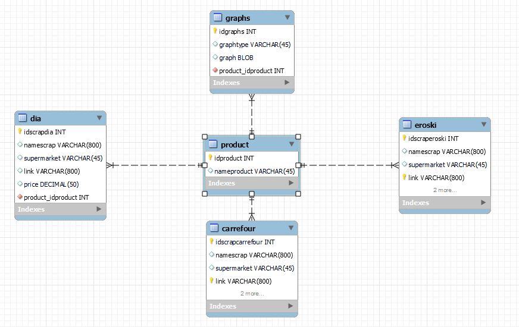

# Buysmart Project
## Why have you done this!?

I have always been interested in economics and prices behaviour. Food prices are very variable so creating a predicting tool could be a nice challenge.

This project makes it easier to understand how food prices have been variating during last years and get a prediction for the next years.

## TOOLS AND PROCESS
1. Getting historical food prices making [API](https://en.wikipedia.org/wiki/API) requests to [Agrifood](https://agridata.ec.europa.eu/extensions/DataPortal/API_Documentation.html).

2. Cleaning, organizing and unifying categories.

3. Predicting the prices based on the historical data using FB PROPHET.

4. Getting today's food prices from different supermarkets (conditional scrapping) using SELENIUM.

5. Creating a database to store and organize my data using SQL.

6. Filtering the database to get exactly the information I'm looking for.

7. User-friendly platform to show my graphs and data using STREAMLIT.

8. Making the whole process executable so the end user can just run the program and get all updated information everyday without knowing how the code looks like.